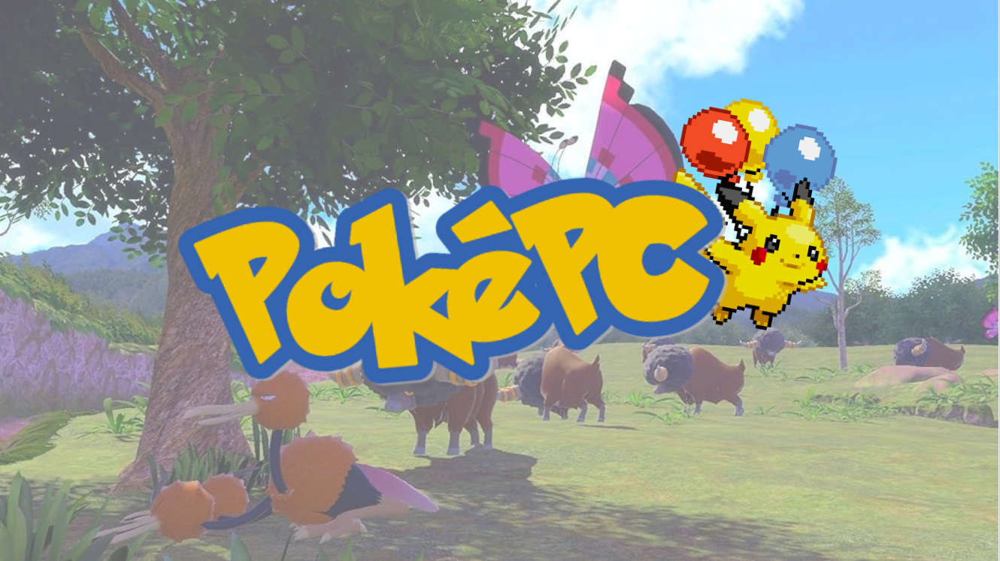
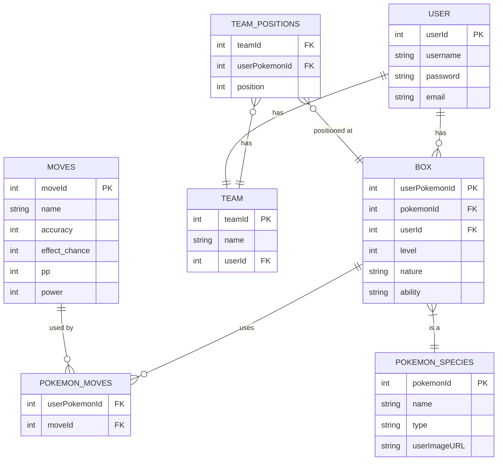
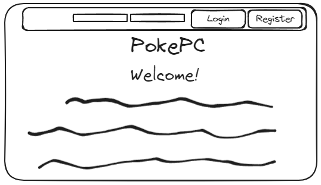
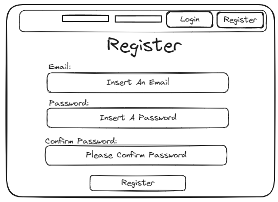
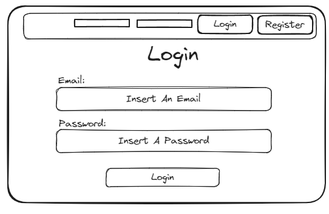
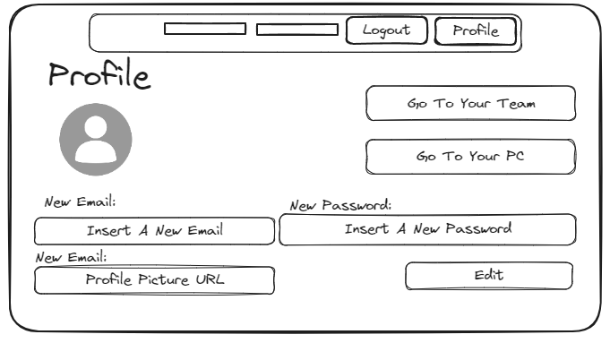
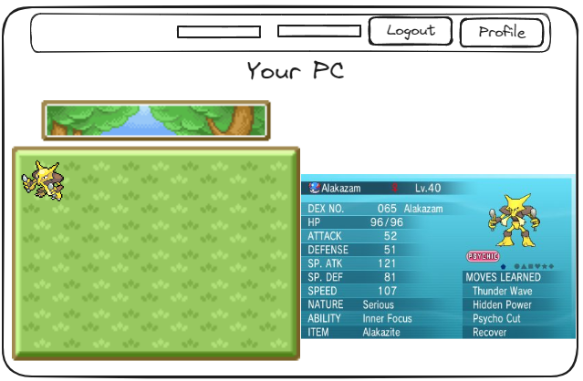
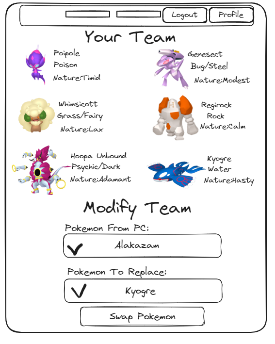

Introducing "PokéPC" – a personalized Pokemon management web app designed for Pokemon enthusiasts. Whether you’re a casual fan of the series or a dedicated pokemon master, PokéPC will provide you with a simplistic platform to manage your Pokemon collection and build your team! This app is designed for:
- Pokemon Collectors: For those who find their pleasure in catching and collecting all sorts of Pokemon. PokePC acts as a digital storage system to catalog and organize your Pokemon.
- Competitive Battlers: Anyone preparing for battles or tournaments can plan and structure their team, adjusting compositions and strategies directly from PokéPC.
- Casual Players: Even if you play the games for fun, PokéPC offers a simple way to track and manage the Pokemon you’ve captured throughout your adventures.

Many existing Pokemon management tools online can be overbearing or lack friendly easy-to-use UIs, making it difficult for players to keep track of their teams. PokePC aims to fill this gap by offering an intuitive platform that simplifies Pokemon management while still providing depth for serious players. With features like easy drag-and-drop team adjustments and details for each Pokemon, PokéPC is the perfect tool for anyone looking to take their Pokemon experience to the next level.

## 🧱 Core Functionality

- Pokemon PC Management: Users can add, update, or remove Pokemon from their PC.
- Team Management: Users can create and adjust their team of six Pokemon.
- User Account Management: Registration, login, and logout functionalities for user-specific access and data security.
- Pokemon Level Tracking: Each Pokemon’s level can be recorded and adjusted as they gain experience in battles.
- Drag-and-Drop Interface: Users can easily drag Pokemon between their PC and active team.

### Requirements

#### Pokemon PC Management Stories: 

- As a user, I want to add a Pokemon to my PC so that I can keep track of all the Pokemon I have collected.
- As a user, I want to update the information of a Pokemon in my PC (ex: level) to reflect the changes as it grows and evolves.
- As a user, I want to remove a Pokemon from my PC if I no longer wish to keep it.

#### Team Management Stories

- As a user, I want to create a team of six Pokemon so that I can prepare for battles and competitions.
- As a user, I want to add a Pokemon from my PC to my team to tailor my team’s capabilities and strategies.
- As a user, I want to remove a Pokemon from my team to make space for others or to adjust my battle strategy.
- As a user, I want to rearrange the Pokemon in my team using a drag-and-drop interface to easily modify team order without multiple steps.
- As a user, I want to be able to copy another users team.

#### User Management Stories

- As a user, I want to register for an account so I can personalize and save my Pokemon collection and teams.
- As a user, I want to log into my account to access my saved Pokemon and team configurations.
- As a user, I want to log out of my account to ensure my data is secure when I'm not using the app.

#### Interaction and Usability Stories

- As a user, I want to view all the Pokemon I have in my PC in a list/grid view so that I can easily manage and access my collection.
- As a user, I want to view my team separately from my PC storage to easily distinguish between stored Pokemon and those in my active lineup.
- As a user, I want to view all the teams of ther users.

## ᛦ Entity Relationships

-   **Authentication System:** Handles the user's ability to register for a new account, log in with a unique username and password, log out, and manage user sessions to ensure that their Pokemon collection and team configurations are personal and secure.
-   **Pokemon Management:** Manages the logic for adding new Pokemon to the user's PC, updating their details (like level and stats), and removing Pokemon from the user's collection as needed.
-   **Team Management:** Allows for the creation and management of a user's Pokemon team. Users can add Pokemon to their team, rearrange team order, and remove Pokemon from the team.
-   **UI Elements:** Includes the design of various elements such as forms for adding or updating Pokemon, grids for displaying the user's PC and team, and interactive elements for managing Pokemon within these lists.

## 📍 API Routes

### Pokemon Management

| Request                                | Action                                 | Response         | Description                                             |
|----------------------------------------|----------------------------------------|------------------|---------------------------------------------------------|
| POST /box/:boxId/pokemon/:pokemonId/   | PokemonController::addPokemon          | 201 /pokemon/box | Add a new Pokemon to the user's PC storage.             |
| GET  /box/:boxId/pokemon/:pokemonId/   | PokemonController::getPokemon          | 200 /pokemon/box | Retrieve details of a specific Pokemon.                 |
| PUT  /box/:boxId/pokemon/:pokemonId/   | PokemonController::updatePokemon       | 200 /pokemon/box | Update an existing Pokemon’s level or other attributes. |
| DELETE /box/:boxId/pokemon/:pokemonId/ | PokemonController::removePokemonFromPC | 204              | Remove a Pokemon from the user's PC.                    |

### User Accounts

| Request                         | Action                                 | Response       | Description                                             |
|---------------------------------|----------------------------------------|----------------|---------------------------------------------------------|
| POST /users/register            | UserController::registerUser           | 201 /users/:id | Register a new user and redirect to the user’s profile. |
| POST /users/login               | UserController::loginUser              | 200 /users/:id | Authenticate a user and start a session.                |
| POST /users/logout              | UserController::logoutUser             | 204            | End the user’s session.                                 |

### Team Management

| Request                         | Action                                 | Response  | Description |
|---------------------------------|----------------------------------------|-----------|--------------------------------------------------|
| PUT /team/:teamid/pokemon/swap          | TeamController::updateTeam             | 200       | Swap a position of two Pokemon                   |
| GET /team/:teamid/pokemon               | TeamController::getTeam                | 200 /team | Retrieve the details of the user's current team. |  
| DELETE /team/:teamid                    | TeamController::deleteTeam             | 204       | Remove all Pokemon from the team.                |
| DELETE /team/:teamid/pokemon/:pokemonId | TeamController::deleteTeam             | 204       | Remove all Pokemon from the team.                |

## 📐 Wireframes

The welcome view is the landing page after login, greeting the user and providing a pleasant entry point into the app. It's designed to be simple and welcoming.

New users will use the register view to create an account for the PokePC app. It requires an email, a password, and confirmation of the password to ensure security. Once the information is provided, a new account is created upon clicking the "Register" button.

The login view is the gateway for users to access their personal PokePC account. It includes fields for email and password, as well as a login button

The profile view provides personalization options for the user. They can update their email and password, and provide a URL for their profile picture. Links to navigate to the user's team or PC are also available for quick access.

This view displays the user's PC, where all captured Pokemon are stored. It showcases individual Pokemon with their stats, such as level, type, nature, and abilities. Users can interact with each Pokemon to manage their collection, potentially transferring them to their team.

This view allows users to add Pokemon to their collection. It features a dropdown menu where users can select from available Pokemon, and a button to confirm the addition.

The team view is where users manage their active team of six Pokemon. Each Pokemon is displayed with relevant stats and can be managed directly from this screen.

