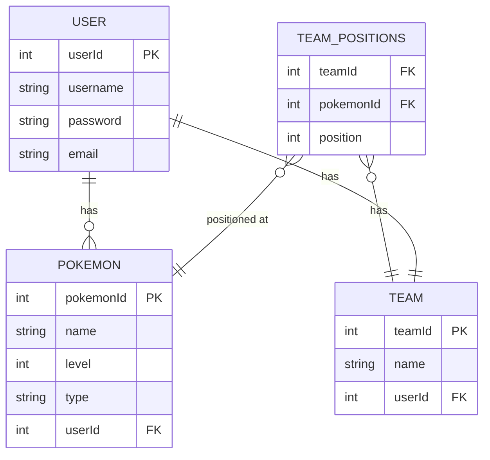

Introducing "PokéPC" – a personalized Pokemon management web app designed for Pokemon enthusiasts and gamers. Whether you’re a casual fan of the series, or a dedicated pokemon master, PokéPC will provide you with a streamlined platform to manage your Pokemon collection and build your ultimate fighting team! This app is designed for:
- Pokemon Collectors: For those who find their pleasure in catching and collecting all sorts of Pokemon, PokePC serves as a digital storage system to catalog and organize your Pokemon efficiently.
- Competitive Gamers: Anyone preparing for battles or tournaments can plan and structure their team, adjusting compositions and strategies directly from PokéPC.
- Casual Players: Even if you play the games for fun, PokéPC offers a simple way to track and manage the Pokemon you’ve captured throughout your adventures.

Many existing Pokemon management tools online can be cumbersome or lack friendly easy-to-use UIs, making it difficult for players to keep track of their teams effectively. PokePC aims to fill this gap by offering a simplistic, intuitive platform that simplifies Pokemon management while still providing depth for serious players. With features like easy drag-and-drop team adjustments and details for each Pokemon, PokéPC is the perfect tool for anyone looking to take their Pokemon experience to the next level.

## 🧱 Core Functionality

- Pokemon PC Management: Users can add, update, or remove Pokemon from their PC, which acts as a digital pokemon storage system.
- Team Management: Users can create and adjust their team of six Pokemon, which is ideal for showing favorites or preparing for battle.
- User Account Management: Registration, login, and logout functionalities for user-specific access and data security.
- Pokemon Level Tracking: Each Pokemon’s level can be recorded and adjusted as they gain experience in battles.
- Drag-and-Drop Interface: Users can easily drag POkemon between their PC and active team.

### Requirements

#### Pokemon PC Management Stories: 

- As a user, I want to add a Pokemon to my PC so that I can keep track of all the Pokemon I have collected.
- As a user, I want to update the information of a Pokemon in my PC (ex: level) to reflect the changes as it grows and evolves.
- As a user, I want to remove a Pokemon from my PC if I no longer wish to keep it.

#### Team Management Stories

- As a user, I want to create a team of six Pokemon so that I can prepare for battles and competitions.
- As a user, I want to add a Pokemon from my PC to my team to tailor my team’s capabilities and strategies.
- As a user, I want to remove a Pokemon from my team to make space for others or to adjust my battle strategy.
- As a user, I want to rearrange the Pokemon in my team using a drag-and-drop interface to easily modify team order without multiple steps.

#### User Management Stories

- As a user, I want to register for an account so I can personalize and save my Pokemon collection and teams.
- As a user, I want to log into my account to access my saved Pokemon and team configurations.
- As a user, I want to log out of my account to ensure my data is secure when I'm not using the app.

#### Interaction and Usability Stories

- As a user, I want to view all the Pokemon I have in my PC in a list/grid view so that I can easily manage and access my collection.
- As a user, I want to view my team separately from my PC storage to easily distinguish between stored Pokemon and those in my active lineup.

## ᛦ Entity Relationships

-   **Authentication System:** Handling user registration, login, logout, and session management.
-   **Project Management:** Logic for project creation, joining projects, and CRUD operations on projects.
-   **Task Management:** Logic for task creation, assignment, updates, filtering, and notifications.
-   **UI Elements:** Design of forms, task lists, project overview, notification lists.

## 📍 API Routes

### Pokemon Management

| Request                         | Action                                 | Response         | Description                                             |
|---------------------------------|----------------------------------------|------------------|---------------------------------------------------------|
| POST /users/:id/pc              | PokemonController::addPokemon          | 201 /pokemon/box | Add a new Pokemon to the user's PC storage.             |
| GET /pokemons/:id               | PokemonController::getPokemon          | 200 /pokemon/box | Retrieve details of a specific Pokemon.                 |
| PUT /users/:id/pc/:pokemonId    | PokemonController::updatePokemon       | 200 /pokemon/box | Update an existing Pokemon’s level or other attributes. |
| DELETE /users/:id/pc/:pokemonId | PokemonController::removePokemonFromPC | 204              | Remove a Pokemon from the user's PC.                    |

### User Accounts

| Request                         | Action                                 | Response       | Description                                             |
|---------------------------------|----------------------------------------|----------------|---------------------------------------------------------|
| POST /users/register            | UserController::registerUser           | 201 /users/:id | Register a new user and redirect to the user’s profile. |
| POST /users/login               | UserController::loginUser              | 200 /users/:id | Authenticate a user and start a session.                |
| POST /users/logout              | UserController::logoutUser             | 204            | End the user’s session.                                 |
| DELETE /users/:id/pc/:pokemonId | PokemonController::removePokemonFromPC | 204            | Remove a Pokemon from the user's PC.                    |

### Team Management
| Request                         | Action                                 | Response  | Description                                                                                                            |
|---------------------------------|----------------------------------------|-----------|------------------------------------------------------------------------------------------------------------------------|
| PUT /users/:id/team             | TeamController::updateTeam             | 200       | Create or update the user's team. If the team does not exist, create it; if it exists, update it with new Pokemon IDs. |
| GET /users/:id/team             | TeamController::getTeam                | 200 /team | Retrieve the details of the user's current team.                                                                       |
| DELETE /users/:id/team          | TeamController::deleteTeam             | 204       | Remove all Pokemon from the team.                                                                                      |
| DELETE /users/:id/pc/:pokemonId | PokemonController::removePokemonFromPC | 204       | Remove a Pokemon from the user's PC.                   

## 📐 Wireframes

>[!note]
> Don't go crazy detailed with the wireframes! These should be minimal sketches to convey to the customer what the app will roughly look like. These things tend to change over time as requirements evolve, but you need to start from somewhere.

The login view is the initial screen where users can enter their credentials to log into their account. It typically consists of a form with input fields for the username/email and password, along with a "Login" button. The login view should also include a link to the registration page for new users who don't have an account yet.

All the tasks for the logged in user where they can sort by title, due date, and created date. They can also filter tasks to only see completed or uncompleted tasks. The user can check off tasks here, or if they want a more detailed view, can click on one of the tasks (see next view).

This view shows the user more details for one specific task. If a due date was set, it will tell them how many days from now the task is due. There is a description field to provide more context for the task, as well as task actions to mark the task as complete, edit the task, or delete. On the right we have a sub-task list so that the user can breakdown the task steps even further. The sub-tasks can be checked off when completed.

The user profile shows the user's profile picture if set, and gives them a place where they can update their email and password. Here is also where they can control if the site is displayed in light or dark mode depending on the value of the toggle switch.
